# SmartLab — Computer Lab Monitoring & Management System

A centralized web application built to automate, monitor, and manage computer
lab operations in an academic institution — built as our final-year BCA
project (team of 4).

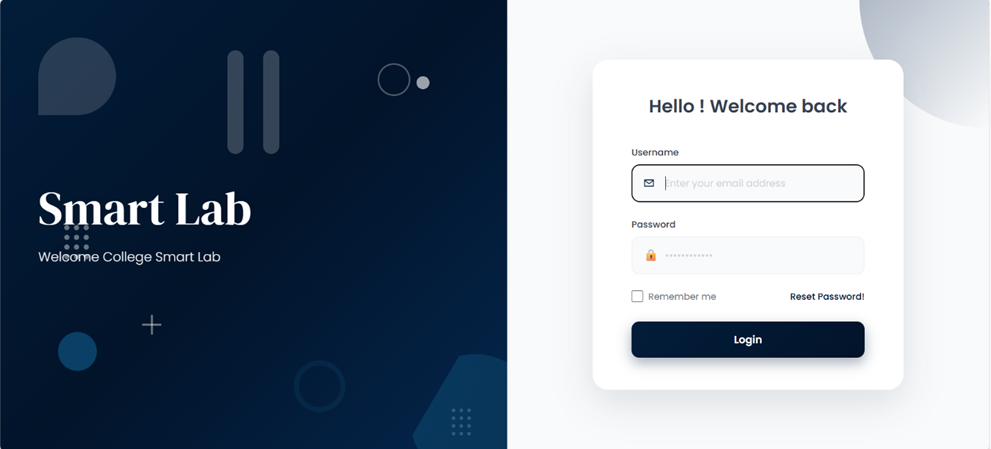

> 📌 **Note on this repo:** This is an archival/reference version of the
> project. The original source lived on a lab machine that's no longer
> accessible — what's preserved here is the code appendix and screenshots
> from our final submitted report. See [Repo status](#repo-status) below.

## Overview

Most college computer labs are still managed manually — attendance on paper,
systems allocated by hand, and supervision during exams limited to walking
around the room. SmartLab replaces that with a single platform that gives
Admins, Staff, Lab Assistants, and Students role-based dashboards, and gives
lab staff the ability to monitor and control lab systems remotely.

## Key Features

- **Role-based authentication** — separate dashboards for Admin, Staff, Lab
  Assistant, and Student
- **Remote lab monitoring** — live screenshot capture, webcam snapshot, and
  running-process visibility per system
- **Remote system control** — shutdown / restart, and automatic termination
  of unauthorized applications during exams
- **Lab & system allocation** — assign students to specific systems per lab
  session
- **Exam scheduling**
- **Online lab work submission**
- **Complaint & feedback management**
- **Attendance tracking**

## Tech Stack

| Layer | Technology |
|---|---|
| Frontend | HTML5, CSS3, Bootstrap, JavaScript |
| Backend | Python, Django (MVC, built-in auth, ORM) |
| Database | MySQL (schema/queries managed via SQLyog) |
| Companion mobile app | Flutter / Dart (built by a teammate, communicates with the Django backend over HTTP/JSON) |
| Monitoring agent | Python client script (pyautogui, OpenCV, psutil, WMI) running on lab machines, polling the server for commands |

## My Role

I built the entire web application — frontend, backend, and database design
— covering all four role-based dashboards, the MySQL schema for lab
allocation/attendance/complaints, and the Django views/business logic. The
Android companion app was built separately by a teammate and communicates
with this backend over HTTP.

## Screenshots

| | |
|---|---|
| 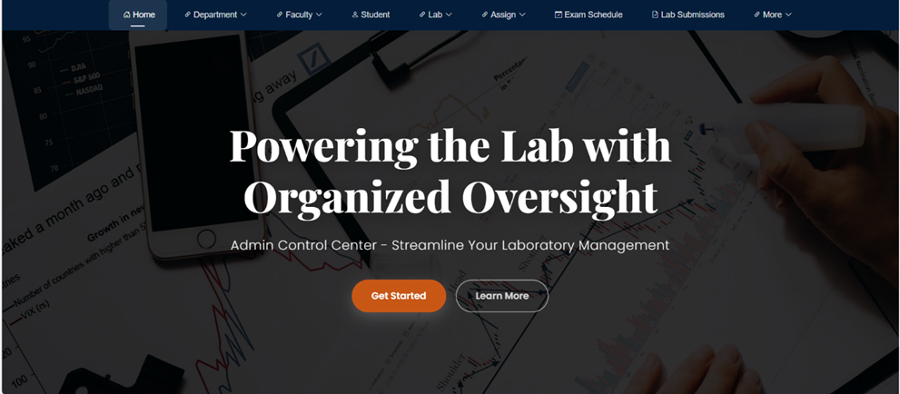 Admin Dashboard | 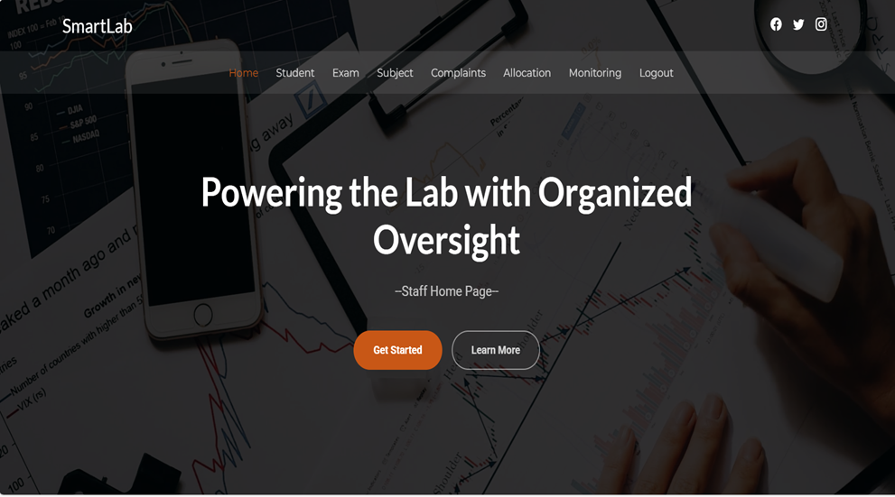 Staff Module |
| 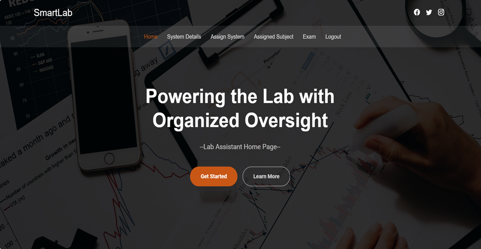 Lab Assistant Module | 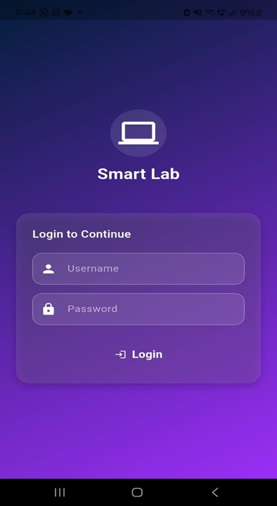 Student Module |
| 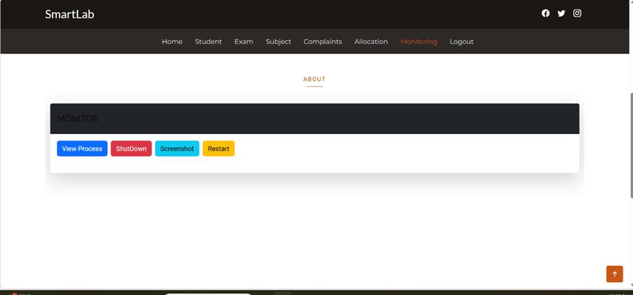 Monitoring (view process / shutdown / screenshot / restart) | 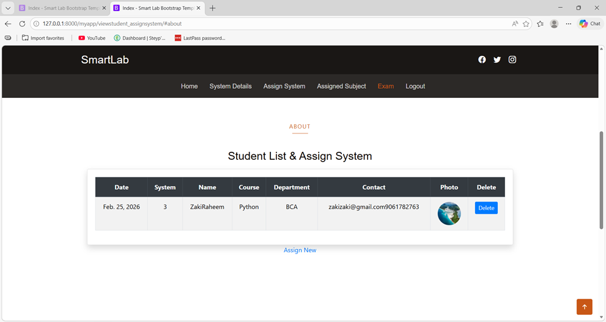 Lab System Allocation |
| 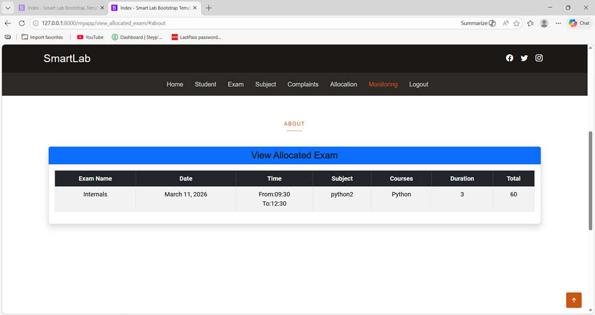 Exam Schedule Update | 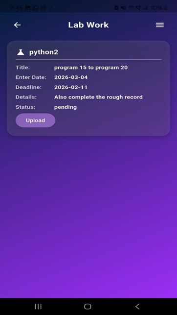 Lab Work Submission |
| 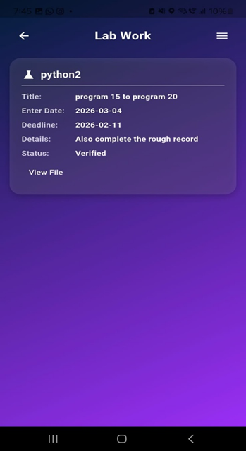 Complaint | 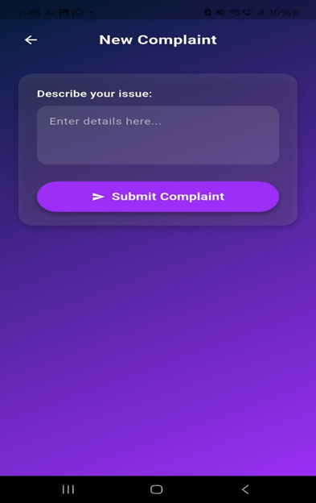 Feedback |

## How Monitoring Works

Each lab machine runs a small Python client (`monitoring_agent/`) that:

1. Polls the Django server for pending commands against its system ID
2. On a `screenshot` command — captures the screen (pyautogui) and a webcam
   frame (OpenCV), uploads both to the server
3. On a `shutdown` / `restart` command — runs the corresponding system call
4. On a `process list` command — enumerates running processes (psutil / WMI)
   and reports them back; if a restricted process is running, kills it
   automatically

This is why the project can't be spun up as a public live demo — the
monitoring feature depends on a Windows client with local screen/camera/process
access, not something that works over the public internet. See the demo
video linked in the case study on my portfolio instead.

## Repo Status

The full project folder was on a lab computer that's no longer accessible.
What's kept here:

- `docs/screenshots/` — the actual UI screenshots from the working system,
  pulled from our submitted final report
- `reference/views_from_report.py` — the Django `views.py` logic, extracted
  from the report's code appendix. **This is a reference copy, not a clean
  checkout** — PDF extraction doesn't preserve exact indentation, so it needs
  reformatting before it would run. `models.py`, `urls.py`, templates, and
  static assets weren't included in the report appendix and aren't recovered.

I'm keeping this repo as an honest record of the work rather than faking a
runnable checkout.

## Future Enhancements

- Web-based live screen streaming instead of periodic screenshots
- Push notifications for complaint/feedback status updates
- Analytics dashboard for lab usage patterns

## Team

Built by a team of 4 for our BCA final year project (2023–2026), Department
of Computer Applications, SAFI Institute of Advanced Study, under the
guidance of Anshid Babu T.M.
